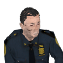

### Introduction
BrainBread 2, also known as BrainBread: Source has been in development for almost a decade, the goal was to rebuild the ancient master-piece mod for Half-Life 1, [BrainBread](https://www.moddb.com/mods/brainbread).

In 2016 BrainBread 2 was released on Steam as a standalone sourcemod. 
The game contained a vast spectrum of gamemodes, maps, weapons and customization.
Now anyone can feel free to contribute to this development, now that BrainBread 2 is open source!

### Compiling
Use the VPC scripts to generate the necessary project file(s), see
[Source SDK 2013 Compiling Help](https://developer.valvesoftware.com/wiki/Source_SDK_2013) for additional help.
* Windows: You can use VS2010, VS2013, VS2015, VS2017, VS2019, or VS2022 to compile this project.
* Linux: Use GCC 4.8 or GCC 5 compiler.
* OSX: Use XCode 10, run osx_compile.

### Contributing
Feel free to post issues, pull requests and such.
However, if you create a pull request, be sure to test your changes properly before submitting the request!

### Future Implementations & Improvements
- [ ] Add skill tree templates for fast switching between skill choices.
- [ ] Improve movement mechanics, such as camera movement when reloading weapons, more viewmodel swaying/movement.
- [ ] Add support for multiple arms per character model.

### Current Bugs
* Writing 'connect ip:port' in the console while in-game will bug if the server is password protected, you have to open the main menu in order to write in the desired password. (assuming you're using the console when the main menu isn't up)
* Very rare and random crash which occurs when you click OK on the motd in-game, when you're about to enter the game. (spawn)
* Sometimes viewmodels will randomly go invisible until you respawn/get a new weapon of the same type.
* When recording via HLTV, the objective HUD will be hidden.
* Changing resolution while the motd is up will create unforeseen consequences.
* Spectating starts inside the player, you have to refresh the spectate mode to fix this issue at this time.
* Sometimes sliding might get you stuck.

### CI

